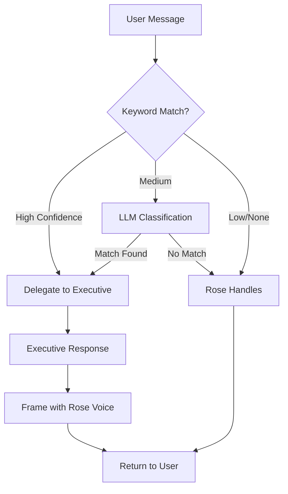

# Organizational Hierarchy

Rose operates as the **Chief of Staff**, orchestrating a team of C-Suite executive agents.

## Org Chart

```
CEO (Patrik)
    └── Rose (Chief of Staff / Executive Assistant)
        ├── CTO → SW Eng, AI Eng, Infra Eng, QA Eng
        ├── CFO → Budget Analyst, Investment Analyst, Billing Agent
        ├── CMO → Content Strategist, SEO Specialist, Social Media Manager
        ├── COO → Project Manager, Process Designer, Automation Coordinator
        ├── CKO → Documentation Agent, Research Agent, Knowledge Curator
        ├── CPO → Product Manager, UX Reviewer, Requirements Analyst
        └── CSO → Strategy Analyst, Market Researcher, Risk Analyst
```

## Executive Domains

| Executive | Domain | Model | Keywords |
|-----------|--------|-------|----------|
| [[CTO]] | Technology | opus | code, build, deploy, bug, api, database |
| [[CFO]] | Finance | sonnet | budget, cost, invoice, payment, expense |
| [[CMO]] | Marketing | sonnet | content, social, brand, campaign, seo |
| [[COO]] | Operations | sonnet | process, workflow, schedule, project |
| [[CKO]] | Knowledge | sonnet | research, document, learn, summarize |
| [[CPO]] | Product | sonnet | feature, roadmap, ux, requirement |
| [[CSO]] | Security | opus | security, compliance, risk, audit |

## Routing Logic

Rose uses a two-tier routing system:

### 1. Keyword Matching (Fast)
- Scans message for domain keywords
- Returns match with confidence score
- Score based on keyword specificity and count

### 2. LLM Classification (Fallback)
- Uses Haiku for fast classification
- Triggered when keyword confidence < 0.7
- Provides semantic understanding

### Routing Thresholds
- **≥ 0.7 confidence**: Delegate to executive
- **0.4 - 0.7**: Use LLM fallback
- **< 0.4**: Rose handles directly

## Delegation Flow



## Implementation Files

| File | Purpose |
|------|---------|
| [[src/org/hierarchy.js]] | Org structure definition |
| [[src/org/router.js]] | Intent classification |
| [[src/org/delegator.js]] | Agent spawning interface |
| [[src/org/index.js]] | Module entry point |
| [[src/core/rose.js]] | Main delegation integration |

## Related
- [[Rose Overview]]
- [[Rose Personality]]
- [[Architecture]]
- [[Agent Architecture]]

---
*Last updated: {{date}}*
